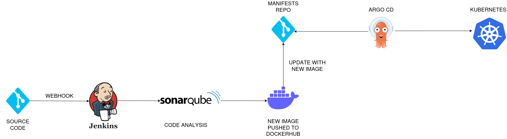

# End-to-End CI/CD Pipeline with Jenkins and ArgoCD

## Project Overview

This repository demonstrates an end-to-end CI/CD pipeline for a Flask application, utilizing Jenkins for automation, Docker for containerization , GitHub webhooks for auto-triggering, and ArgoCD for Kubernetes deployment. The project integrates static code analysis, Docker image management, and Kubernetes cluster updates seamlessly.

---



---

## Project Workflow

### 1. **Repository Checkout**
- The pipeline begins by checking out this repository containing the Flask application source code.

### 2. **Static Code Analysis**
- Jenkins performs static code analysis using **SonarQube** to ensure code quality.

### 3. **Build Docker Image**
- A Docker image for the Flask application is built using the `Dockerfile` in the repository.

### 4. **Push Docker Image**
- The Docker image is pushed to Docker Hub with a version tag corresponding to the Jenkins build number.

### 5. **Update Kubernetes Manifests**
- The pipeline checks out another repository, `cicd-k8s-manifests`, which contains Kubernetes deployment and service files.
- The deployment file is updated with the new Docker image tag.

### 6. **Push Updated Manifests**
- The updated Kubernetes manifests are committed and pushed back to the `cicd-k8s-manifests` repository.

### 7. **ArgoCD Synchronization**
- ArgoCD continuously monitors the `cicd-k8s-manifests` repository for changes.
- Upon detecting changes, ArgoCD updates the Kubernetes cluster to deploy the latest version of the Flask application.

---

## Key Files

### 1. **Application (`application/`)**
- Contains the source code for the Flask application.
- Implements the core functionality of the application.

### 2. **Jenkinsfile**
- Defines the CI/CD pipeline with the following stages:
  - Checkout repository
  - Static code analysis via SonarQube
  - Build Docker image
  - Push Docker image to Docker Hub
  - Checkout and update Kubernetes manifests
  - Push updated manifests to the `cicd-k8s-manifests` repository

### 3. **Dockerfile**
  Builds a Docker image for the Flask application.

### 4. **ArgoCD Configurations** (argocd-basic/)

  Contains ArgoCD configuration files for setting up and monitoring the deployment of the Flask application.


---

## Prerequisites

  - Jenkins
  - SonarQube
  - Docker
  - Kubernetes cluster (minikube for local development)
  - ArgoCD


---

## Installing

  ### **Jenkins**
   ``` bash
      curl -fsSL https://pkg.jenkins.io/debian/jenkins.io-2023.key | sudo tee \
      /usr/share/keyrings/jenkins-keyring.asc > /dev/null
    echo deb [signed-by=/usr/share/keyrings/jenkins-keyring.asc] \
      https://pkg.jenkins.io/debian binary/ | sudo tee \
      /etc/apt/sources.list.d/jenkins.list > /dev/null
      sudo apt-get update
      sudo apt-get install jenkins
  ```

  ### **Docker**
  ``` bash
      sudo apt update
      sudo apt install docker.io
  ```

  ### **SonarQube**
  ```bash
      apt install unzip
      adduser sonarqube
      wget https://binaries.sonarsource.com/Distribution/sonarqube/sonarqube-9.4.0.54424.zip
      unzip *
      chmod -R 755 /home/sonarqube/sonarqube-9.4.0.54424
      chown -R sonarqube:sonarqube /home/sonarqube/sonarqube-9.4.0.54424
      cd sonarqube-9.4.0.54424/bin/linux-x86-64/
      ./sonar.sh start
  ```


## License

  This project is licensed under the MIT License.

